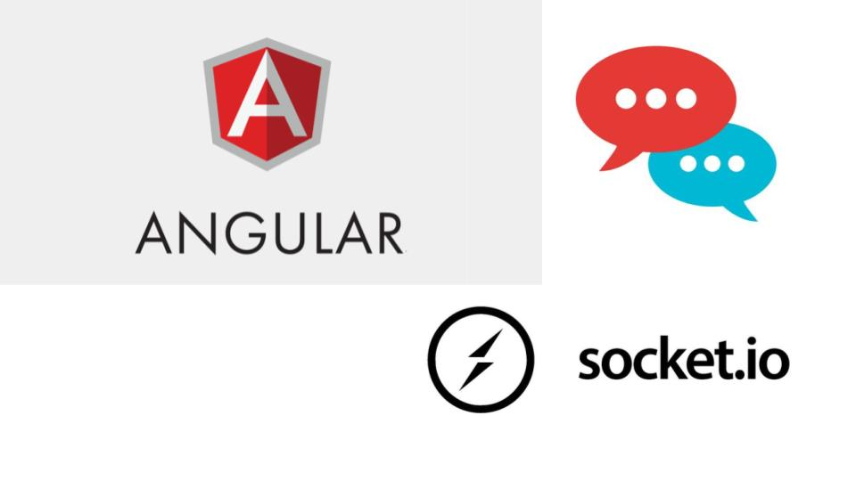
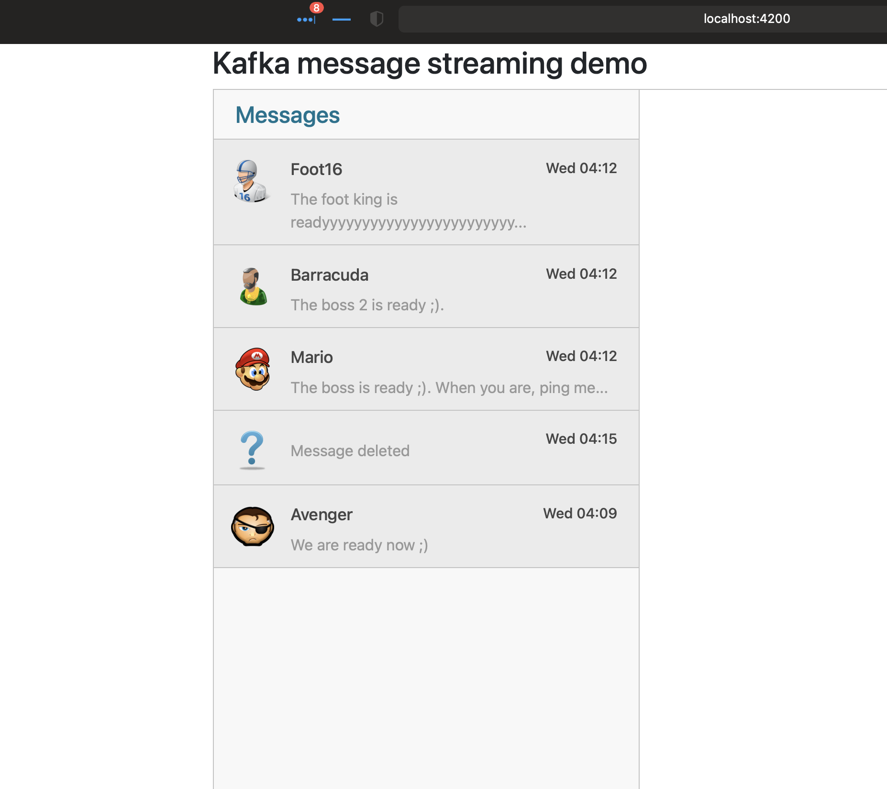

# Messages web app with Angular and Websocket

## Build

`ng build`

## Requirements

Before running the web app we need to prepare the associated webservices and notifications server, 
we must run the backend ([kafka-with-nestjs](https://github.com/idirnaitali/kafka-with-nestjs))
and then use the exposed APIs to post, update and delete messages, 
see [this README](https://github.com/idirnaitali/kafka-with-nestjs/blob/master/README.md))

## Run

Run `ng serve` for a dev server. Navigate to `http://localhost:4200/`.

## Demo 😉

To test, see the [server README](https://github.com/idirnaitali/kafka-with-nestjs/blob/master/README.md).

## Websocket config

Create Socket config on `app.module.ts`
like: `const config: SocketIoConfig = { url: 'http://localhost:8080', options: {}};`
and then add this module Socket config `SocketIoModule.forRoot(config)` on `imports`. It will connect the web socket part of
the app to the web socket server.
